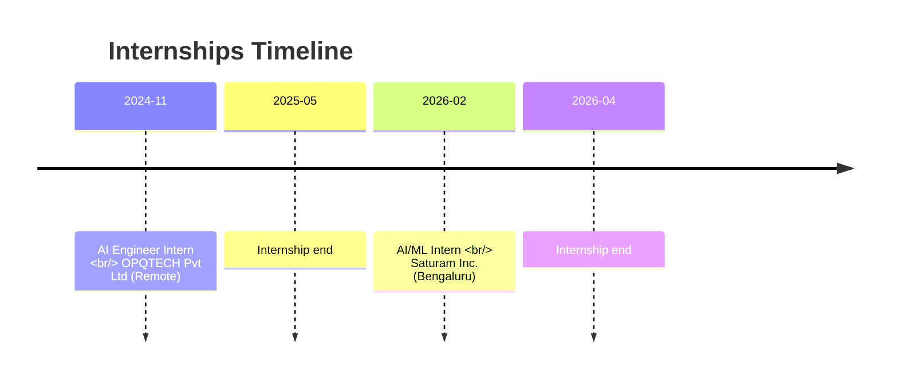

  <!-- Replace USERNAME in the URL query string below if you change your GitHub username -->
  <!-- The version suffix (?v=...) is updated automatically by the update-profile workflow to bust caches -->
  

  <!-- REPLACE LINKEDIN/GITHUB/EMAIL URLS AND USERNAMES IN THE Badges BELOW -->
  <a href="https://github.com/pavanbr593"><!-- COMMENT: Replace with your GitHub URL if changed --></a>&nbsp;
  <a href="https://www.linkedin.com/in/pavan-bendre-r"><!-- COMMENT: Replace with your LinkedIn profile URL --></a>&nbsp;
  <a href="mailto:pavanbr593@gmail.com"><!-- COMMENT: Replace with your Email address --></a>&nbsp;
  <a href="./assets/Pavan%20Resume.pdf" target="_blank"><!-- COMMENT: Path to your Resume PDF --> </a>&nbsp;
  <a href="https://pavanbr-portfolio.vercel.app" target="_blank"><!-- COMMENT: Replace with your Portfolio URL if available --></a>&nbsp;
  

---

  
  ## 🚀 Recent AI/ML Graduate & GenAI Specialist
  
  > Senior-focused **AI/ML Graduate (VTU, 2026)** with production-deployed experience in **agentic pipelines, RAG systems, and Government AI**. 
  > Engineered a police bandobast scheduling system adopted by the **Shivamogga Police Department**, earned an **IEEE Best Paper Award in healthcare AI**, and published a technical book on **IoT and Edge AI**. 
  > Specializes in **LLM orchestration, multi-agent systems, Hugging Face Transformers, and FastAPI-backed AI services** across enterprise, healthcare, and public-sector domains.

---

### 🔮 Current Focus & Specializations

- 🤖 **Agentic Workflows**: Multi-agent LLM orchestration using LangChain, Groq, Llama 3.3, and fallback handlers.
- 🔎 **Multi-Modal RAG Platforms**: Citation-backed knowledge discovery over complex PDF and image formats.
- ⚡ **Zero-Cloud Local Inference**: High-performance local embedding retrieval (FAISS/CLIP/Phi-3) with sub-2s latency.
- 🌐 **Public Sector Impact**: Scaled duty scheduling solutions to support local government automation.

---

### 🛠️ Technical Skills & Tools

<table>
  <tr>
    <td width="50%" valign="top">

    ### 🤖 AI / GenAI & LLM Stack
    - **GenAI Concepts**: Agentic AI, Multi-Agent Orchestration, RAG, LLM Orchestration, LLM Evaluation
    - **LLMs & APIs**: Llama 3.3 (Groq), Phi-3, Gemini, OpenAI API, Hugging Face
    - **Frameworks**: LangChain, SentenceTransformers, CLIP

    </td>
    <td width="50%" valign="top">

    ### 🧠 Machine Learning & CV
    - **Frameworks**: PyTorch, TensorFlow, scikit-learn
    - **Specializations**: Model Fine-Tuning, Computer Vision, NLP
    - **Algorithms**: Regression Models, Intent Classification, NER

    </td>
  </tr>
  <tr>
    <td width="50%" valign="top">

    ### ☁️ Cloud, DevOps & Vectors
    - **Vector DBs**: FAISS, Chroma, Pinecone
    - **DevOps**: Docker, CI/CD (GitHub Actions), n8n Automation
    - **Cloud**: GCP (Google Cloud Platform), Microsoft Azure

    </td>
    <td width="50%" valign="top">

    ### 🌐 Backend & Frontend Development
    - **Languages**: Python, TypeScript, JavaScript, C++, C
    - **Backend APIs**: FastAPI, Flask, REST APIs, SQL, MongoDB
    - **Frontend**: React, React Native, Vite, Tailwind CSS, Gradio

    </td>
  </tr>
</table>

### Languages and Tools:

  &nbsp;
  &nbsp;
  &nbsp;
  &nbsp;
  &nbsp;
  &nbsp;
  &nbsp;
  &nbsp;
  &nbsp;
  &nbsp;
  &nbsp;
  &nbsp;
  &nbsp;
  &nbsp;
  &nbsp;
  &nbsp;
  &nbsp;
  &nbsp;
  

---

### 💼 Professional Experience

#### 🏢 AI/ML Intern | Saturam Inc., Bengaluru 
_Feb 2026 – Apr 2026_
* Engineered end-to-end multi-agent orchestration frameworks and automated intelligence reporting pipelines.
* Designed and deployed semantic deduplication handlers, custom rate-limit controllers, and LLM-powered evaluation pipelines.
* Collaborated with team members to deliver enterprise-grade recruitment and research agent assistants.

#### 🏢 AI Engineer Intern | OPQTECH Pvt Ltd, Remote
_Nov 2024 – May 2025_
* Designed and built enterprise-grade multi-modal RAG systems for zero-cloud local knowledge discovery.
* Architected hybrid vector retrieval and local reasoning schemas (Phi-3, CLIP, FAISS) for low-latency executions.
* Structured high-accuracy document parsing and image embedding modules.

---

### 🏆 Featured Projects & Deployment

<table width="100%">
  <tr>
    <td width="50%" valign="top">
      <h4>👮 Police Bandobast Management System</h4>
      
<em>React Native · FastAPI · Real-time Sync · Government Deployed</em>

      <ul>
        <li>AI-assisted duty-allocation system deployed for the Shivamogga Police Department.</li>
        <li>Replaced manual scheduling with real-time, mobile-accessible workflows.</li>
        <li>Achieved <strong>zero scheduling failures</strong> post-deployment, earning an official appreciation letter from the Superintendent of Police.</li>
      </ul>
    </td>
    <td width="50%" valign="top">
      <h4>🔗 Agentic Partnerships-Intelligence Pipeline</h4>
      
<em>LangChain · Groq Llama 3.3 · FAISS · Saturam Inc. Project</em>

      <ul>
        <li>Built an end-to-end partnerships intelligence pipeline processing 400+ articles/run across 12 partner feeds.</li>
        <li>Orchestrated multi-agent flows with Gemini fallbacks, rate-limit handlers, and retry logic.</li>
        <li>Implemented MiniLM + FAISS deduplication, cutting duplicate article noise by ~60%.</li>
      </ul>
    </td>
  </tr>
  <tr>
    <td width="50%" valign="top">
      <h4>🔍 Multimodal RAG System</h4>
      
<em>Phi-3 · CLIP · SentenceTransformers · FAISS · OPQTECH Project</em>

      <ul>
        <li>Engineered a production-grade multi-modal search platform integrating document understanding and image embeddings.</li>
        <li>Architected hybrid vector retrieval and zero-cloud local reasoning (Phi-3) delivering citation-backed answers.</li>
        <li>Achieved explainable knowledge discovery with sub-2s latency and zero external service dependency.</li>
      </ul>
    </td>
    <td width="50%" valign="top">
      <h4>👥 LLM-Powered Recruitment Intelligence Agents</h4>
      
<em>LangChain · LLM Scoring · Recruit-Tech · Saturam Inc. Project</em>

      <ul>
        <li>Engineered recruitment automation agents that evaluate resumes against structured JD criteria.</li>
        <li>Reduced manual screening time by 40% through automated resume parsing and alignment scoring.</li>
      </ul>
    </td>
  </tr>
  <tr>
    <td width="50%" valign="top">
      <h4>🗑️ Illegal Waste Dumping Detection System</h4>
      
<em>YOLOv8 · OpenCV · Computer Vision · Streamlit</em>

      <ul>
        <li>Developed a real-time computer vision system to detect illegal waste dumping in municipal surveillance imagery.</li>
        <li>Trained and optimized a custom YOLOv8 model on annotated waste-management datasets.</li>
        <li>Integrated automated visual evidence logging and detection dashboards for municipal inspectors.</li>
      </ul>
    </td>
    <td width="50%" valign="top">
      <h4>🩺 Non-Invasive Diabetes Prediction System</h4>
      
<em>Regression Models · Gemini LLM · NIR Spectroscopy · Healthcare AI</em>

      <ul>
        <li>ML-based non-invasive glucose prediction from NIR physiological signals with Gemini health insights.</li>
        <li>Achieved <strong>82% prediction accuracy</strong>.</li>
        <li>Expanded into research published on IEEE Xplore and won the <strong>IEEE Best Paper Award</strong>.</li>
      </ul>
    </td>
  </tr>
  <tr>
    <td width="50%" valign="top">
      <h4>📖 Kickstart IoT Systems Engineering</h4>
      
<em>Book Publication (Amazon, 2024)</em>

      <ul>
        <li>Published technical author of a comprehensive book covering IoT systems design.</li>
        <li>Guides developers on building intelligent IoT systems from embedded nodes (Arduino/ESP32) up to Cloud and Edge AI.</li>
      </ul>
    </td>
    <td width="50%" valign="top">
      <!-- Empty space to align the grid layout nicely -->
    </td>
  </tr>
</table>

---

### 📝 Research & Publications

* 🏆 **IEEE Best Paper Award (2025)**
  * _"Non-Invasive Estimation of Blood Glucose by Near-Infrared Spectroscopy and Machine Learning: A Continuous Health Monitoring Prototype"_, published on [IEEE Xplore](https://ieeexplore.ieee.org/abstract/document/11450941).
* 📚 **Published Technical Author (Amazon, 2024)**
  * _"Kickstart IoT Systems Engineering: Build Intelligent IoT Systems from Embedded Devices to Cloud and Edge AI"_, available on [Amazon](https://www.amazon.in/dp/934988724X/ref=cm_cr_dp_d_vote_lft?ie=UTF8&csrfT=hOwb6mKb6WnkZPgBJBKq%252F8b7R8pBEPWnhY%252F41RK%252BLA72AAAAAGnrdZQAAAAB&reviewId=R1MMK090B70CJQ#R1MMK090B70CJQ).

---

### 🎖️ Key Achievements Timeline

* 🎓 **Best Outgoing Student Award** — PES Institute of Technology and Management, June 2026.
* ✉️ **Official Appreciation Letter** — Received from the Superintendent of Police, Shivamogga, for the Police Bandobast Deployment.
* 🎓 **Academic Excellence** — Graduated in Artificial Intelligence & Machine Learning with a **CGPA of 8.33** (VTU, 2026).

---

### 📊 GitHub Stats & Metrics

  <!-- Replace username in the links below if your GitHub username is different -->
  
  

 

  <!-- Replace username in the links below if your GitHub username is different -->
  
  

---

### ⚡ Fun Facts

- 📖 Wrote and published a 200+ page textbook on IoT and Edge AI systems before graduating college.
- 🚨 Built and deployed production software used by police departments to orchestrate real bandobast operations.
- 💡 Big advocate for **fully local GenAI pipelines**—who needs the cloud when you can inference Phi-3 on the edge at sub-2s latencies?

---

  <h3>🤝 Let's Connect!</h3>
  
Always open to discussing AI Agent architectures, MLOps pipelines, RAG systems, or exciting open-source collaborations.

  &nbsp;
  &nbsp;
  &nbsp;

---

  
<i>"The best way to predict the future is to build it."</i> — Alan Kay

