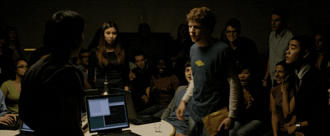
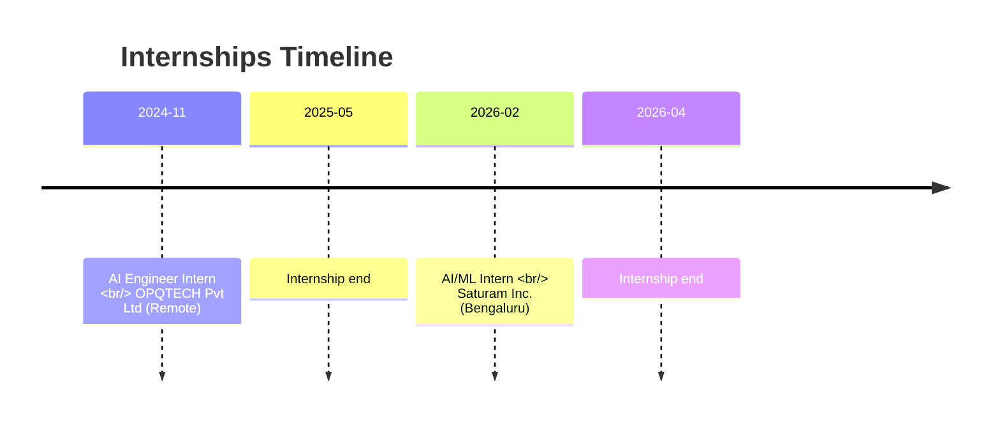

  

  &nbsp;
  &nbsp;
  &nbsp;
  &nbsp;
  &nbsp;
  

  <h1>Hi There, I'm Pavan 😊</h1>

  

<h3 align="center">AI/ML Engineer & Researcher</h3>

  <!-- Replace USERNAME in the URL query string below if you change your GitHub username -->
  <!-- The version suffix (?v=...) is updated automatically by the update-profile workflow to bust caches -->
  

---

  
  > **Recent AI/ML Graduate (VTU, 2026)** with production-deployed experience in **agentic pipelines, RAG systems, and Government AI**. 
  > Built and shipped a police duty-scheduling system adopted by the **Shivamogga Police Department**, earned an **IEEE Best Paper Award in healthcare AI**, and published a technical book on **IoT and Edge AI**. 
  > Specializes in **LLM orchestration, multi-agent systems, Hugging Face Transformers, and FastAPI-backed AI services** across enterprise, healthcare, and public-sector domains.

---

## 💼 Professional Experience

### 🏢 AI/ML Intern | Saturam Inc., Bengaluru
_Feb 2026 – Apr 2026_
* **Agentic Partnership Intelligence**: Built an end-to-end intelligence pipeline processing 400+ articles/run across 12 enterprise partner feeds, eliminating 8+ hours/week of manual research through fully automated LLM brief generation and email delivery.
* **Multi-Agent Orchestration**: Engineered multi-agent LLM orchestration (LangChain + Groq Llama 3.3 70B, Gemini fallback) with rate-limit handling, retry logic, and MiniLM + FAISS semantic deduplication, cutting duplicate article noise by ~60%.
* **HR Agentic Systems**: Delivered LLM-powered recruitment intelligence agents that reduced manual screening time by 40% through automated resume scoring against structured JD criteria.

### 🏢 AI Engineer Intern | OPQTECH Pvt Ltd, Remote
_Nov 2024 – May 2025_
* **Multi-Modal RAG**: Built a production-grade multi-modal Retrieval-Augmented Generation (RAG) platform combining document understanding, image embeddings, and local LLM reasoning to deliver grounded, citation-backed responses across PDFs and images.
* **Edge AI & Vector Systems**: Implemented CLIP + SentenceTransformers embeddings with FAISS vector retrieval and Phi-3 local inference, enabling explainable knowledge discovery with zero cloud dependency and sub-2s retrieval latency.

---

## 🎯 Core Competencies & Skills

<table width="100%">
  <tr>
    <td width="50%" valign="top">
      <h3>🤖 AI, GenAI & Agentic Systems</h3>
      

        
        
        
      

      <ul>
        <li>⚡ <b>GenAI Architectures</b>: <code>Agentic AI</code> · <code>Multi-Agent Orchestration</code> · <code>RAG</code> · <code>Multi-Modal RAG</code> · <code>LLM Evaluation</code></li>
        <li>🧠 <b>LLMs & APIs</b>: <code>Llama 3.3 70B (Groq)</code> · <code>Phi-3</code> · <code>Gemini API</code> · <code>OpenAI API</code> · <code>Hugging Face</code></li>
        <li>🚀 <b>Frameworks</b>: <code>LangChain</code> · <code>SentenceTransformers</code> · <code>CLIP Embeddings</code></li>
      </ul>
    </td>
    <td width="50%" valign="top">
      <h3>🧠 Machine Learning & Computer Vision</h3>
      

        
        
        
      

      <ul>
        <li>📊 <b>ML & Vision Stack</b>: <code>PyTorch</code> · <code>TensorFlow</code> · <code>scikit-learn</code> · <code>YOLOv8</code> · <code>OpenCV</code></li>
        <li>🎯 <b>Specializations</b>: <code>Model Fine-Tuning (LoRA)</code> · <code>Computer Vision</code> · <code>Intent Classification</code> · <code>NER</code></li>
        <li>🩺 <b>Health & Signal Processing</b>: <code>Regression Models</code> · <code>NIR Spectroscopy</code> · <code>Physiological Signals</code></li>
      </ul>
    </td>
  </tr>
  <tr>
    <td width="50%" valign="top">
      <h3>☁️ Vector DBs, Cloud & MLOps</h3>
      

        
        
        
      

      <ul>
        <li>🔍 <b>Vector Search</b>: <code>FAISS</code> · <code>Chroma</code> · <code>Pinecone</code> · <code>Semantic Deduplication (~60% noise cut)</code></li>
        <li>☁️ <b>Cloud Platforms</b>: <code>GCP (Google Cloud Platform)</code> · <code>Microsoft Azure</code></li>
        <li>🛠️ <b>DevOps & Workflows</b>: <code>Docker</code> · <code>CI/CD (GitHub Actions)</code> · <code>n8n Automation</code></li>
      </ul>
    </td>
    <td width="50%" valign="top">
      <h3>🌐 Software Engineering & Web Stack</h3>
      

        
        
        
      

      <ul>
        <li>💻 <b>Core Languages</b>: <code>Python</code> · <code>TypeScript</code> · <code>JavaScript</code> · <code>C++</code> · <code>C</code> · <code>SQL</code></li>
        <li>⚙️ <b>Backend & APIs</b>: <code>FastAPI</code> · <code>Flask</code> · <code>REST APIs</code> · <code>Node.js</code> · <code>Express</code> · <code>MongoDB</code> · <code>PostgreSQL</code></li>
        <li>📱 <b>Frontend & Edge UI</b>: <code>React</code> · <code>React Native</code> · <code>Vite</code> · <code>Tailwind CSS</code> · <code>Gradio</code> · <code>Streamlit</code></li>
      </ul>
    </td>
  </tr>
</table>

## 🏆 Featured Projects & Deployment

<table width="100%">
  <tr>
    <td width="50%" valign="top">
      <h4>👮 Police Bandobast Management System</h4>
      
<em>React Native · FastAPI · Real-time Sync · Government Deployed</em>

      <ul>
        <li>AI-assisted duty-allocation system deployed for the Shivamogga Police Department, replacing conflict-prone manual scheduling with real-time, mobile-accessible workflows.</li>
        <li>Achieved <strong>zero scheduling failures</strong> post-deployment, earning an official appreciation letter from the Superintendent of Police, Shivamogga.</li>
      </ul>
    </td>
    <td width="50%" valign="top">
      <h4>🔗 Agentic Partnerships-Intelligence Pipeline</h4>
      
<em>LangChain · Groq Llama 3.3 · FAISS · Saturam Inc. Project</em>

      <ul>
        <li>Built an end-to-end partnerships intelligence pipeline processing 400+ articles/run across 12 partner feeds, eliminating 8+ hours/week of manual research.</li>
        <li>Orchestrated multi-agent flows with Gemini fallbacks, rate-limit handlers, and retry logic.</li>
        <li>Implemented MiniLM + FAISS deduplication, cutting duplicate article noise by ~60%.</li>
      </ul>
    </td>
  </tr>
  <tr>
    <td width="50%" valign="top">
      <h4>🔎 Multimodal RAG System</h4>
      
<em>Phi-3 · CLIP · SentenceTransformers · FAISS · OPQTECH Project</em>

      <ul>
        <li>Built a production-grade multi-modal RAG platform combining document understanding, image embeddings, and local LLM reasoning to deliver grounded responses across PDFs and images.</li>
        <li>Implemented vector search and local inference with zero cloud dependency and sub-2s retrieval latency.</li>
      </ul>
    </td>
    <td width="50%" valign="top">
      <h4>👥 LLM-Powered Recruitment Intelligence Agents</h4>
      
<em>LangChain · LLM Scoring · Recruit-Tech · Saturam Inc. Project</em>

      <ul>
        <li>Engineered recruitment automation agents that evaluate resumes against structured JD criteria.</li>
        <li>Reduced manual screening time by 40% through automated resume parsing and alignment scoring.</li>
      </ul>
    </td>
  </tr>
  <tr>
    <td width="50%" valign="top">
      <h4>🗑️ Illegal Waste Dumping Detection System</h4>
      
<em>YOLOv8 · OpenCV · Computer Vision · Streamlit</em>

      <ul>
        <li>Developed a real-time computer vision system to detect illegal waste dumping from surveillance imagery.</li>
        <li>Trained and optimized a custom YOLOv8 model on annotated waste-management datasets with visual evidence logging.</li>
      </ul>
    </td>
    <td width="50%" valign="top">
      <h4>🩺 Non-Invasive Diabetes Prediction System</h4>
      
<em>Regression Models · Gemini LLM · NIR Spectroscopy · Healthcare AI</em>

      <ul>
        <li>ML-based non-invasive glucose prediction from NIR physiological signals with Gemini health insights.</li>
        <li>Achieved <strong>82% prediction accuracy</strong>, extended into IEEE Best Paper Award-winning research published on IEEE Xplore.</li>
      </ul>
    </td>
  </tr>
  <tr>
    <td width="50%" valign="top">
      <h4>📖 Kickstart IoT Systems Engineering</h4>
      
<em>Book Publication (Amazon, 2024)</em>

      <ul>
        <li>Published technical author of a comprehensive book covering IoT systems design.</li>
        <li>Guides developers on building intelligent IoT systems from embedded nodes (Arduino/ESP32) up to Cloud and Edge AI.</li>
      </ul>
    </td>
    <td width="50%" align="center" valign="middle">
      
    </td>
  </tr>
</table>

---

## 📝 Research & Publications

* 🏆 **IEEE Best Paper Award (2025)**
  * _"Non-Invasive Estimation of Blood Glucose by Near-Infrared Spectroscopy and Machine Learning: A Continuous Health Monitoring Prototype"_, published on [IEEE Xplore](https://ieeexplore.ieee.org/abstract/document/11450941).
* 📚 **Published Technical Author (Amazon, 2024)**
  * _"Kickstart IoT Systems Engineering: Build Intelligent IoT Systems from Embedded Devices to Cloud and Edge AI"_, available on [Amazon](https://www.amazon.in/dp/934988724X/ref=cm_cr_dp_d_vote_lft?ie=UTF8&csrfT=hOwb6mKb6WnkZPgBJBKq%252F8b7R8pBEPWnhY%252F41RK%252BLA72AAAAAGnrdZQAAAAB&reviewId=R1MMK090B70CJQ#R1MMK090B70CJQ).

---

## 🎖️ Key Achievements & Education

* 🎓 **B.E. in Artificial Intelligence & Machine Learning** (VTU, 2026) — CGPA: **8.33**, PES Institute of Technology and Management.
* 🏆 **Best Outgoing Student Award** — PES Institute of Technology and Management, June 2026.
* ✉️ **Official Appreciation Letter** — Received from the Superintendent of Police, Shivamogga, for zero scheduling failures post-deployment.

---

<h3 align="left">Connect with me: </h3>

---

### 📊 GitHub Statistics & Metrics

  
  

 

  
  <picture>
    <source media="(prefers-color-scheme: dark)" srcset="https://raw.githubusercontent.com/pavanbr593/pavanbr593/output/github-contribution-grid-snake-dark.svg">
    <source media="(prefers-color-scheme: light)" srcset="https://raw.githubusercontent.com/pavanbr593/pavanbr593/output/github-contribution-grid-snake.svg">
    
  </picture>

---

  
<i>"The best way to predict the future is to build it."</i> — Alan Kay

